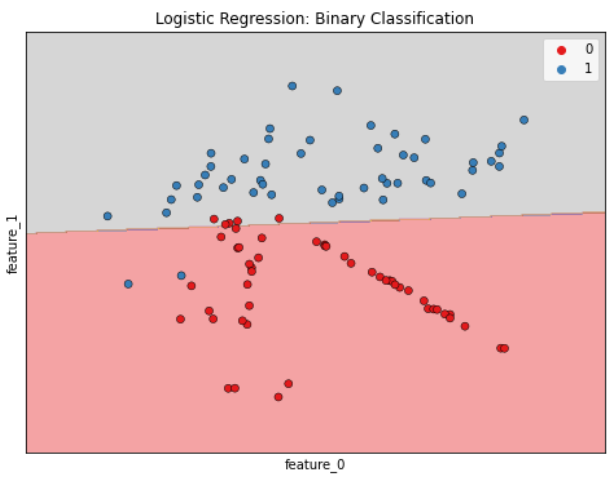

**Logistic regression** a type of regression used in supervised machine learning for binary classification problems. It used features to output the probability (p) on whether or not an observation belongs to a binary class. 
* If p > 0.5, the data is labeled as a member of that class (1). 
* If p < 0.5, the data is NOT labeled as a member (0). 



How to perform logistic regression with scikit-learn:

```python
# Import the library
from sklearn.linear_model import LogisticRegression

# Instantiate the classifier model
logreg = LogisticRegression()

# Split the data
X_train, X_test, y_train, y_test = train_test_split(X, Y, test_size = 0.3, random_state = 99)

# Fit the model
logreg.fit(X_train, y_train)

# Predict from the test set
y_pred = logreg.predict(X_test)
```

We can also get the exact probability for each instance using the predict_proba method, which returns a 2D array of probilities for 0 (left column) and 1 (right column). 

```python
# Apply predict_proba to the right column (index 1)
y_pred_probs = logreg.predict_proba(X_test)[:, 1]
```


The default threshold for p is 0.5, but you can adjust it. An ROC curve will show how different thresholds affect the true positive and false positive rates. As I talked about in yesterday's post about the confusion matrix, the nature of your study will determine whether you care more about false positives (false alarms) or false negatives (missed true positives). 

We can plot an ROC curve in Python using the y_pred_probs from the previous code:

```python
# Import the library
from sklearn.metrics import roc_curve

# Call the roc_curve function. 
# fpr = false positive rate, tpr = true positive rate
fpr, tpr, thresholds = roc_curve(y_test, y_pred_probs)

# Plot the line
plt.plot([0, 1], [0, 1], 'k--')
plt.plot(fpr, tpr)
plt.xlabel('False Positive Rate')
plt.ylabel('True Positive Rate')
plt.title('Logistic Regression ROC Curve')
plt.show()
```

The dotted line in the center represents a model that just randomly guesses. So what does this ROC model actually tell us? 
* We calculate the area under the ROC curve (AUC). Scores range from 0 to 1 with 1 being the best. If the AUC is 0.5, it means the model is no better than a random guess. 
* When the ROC curve is above the dotted line, it means the model is better than just randomly guessing. 

```python
# Run the imports
from sklearn.metrics import roc_auc_score

# Call the auc score and print the results
print(roc_auc_score(y_test, y_pred_probs))
```