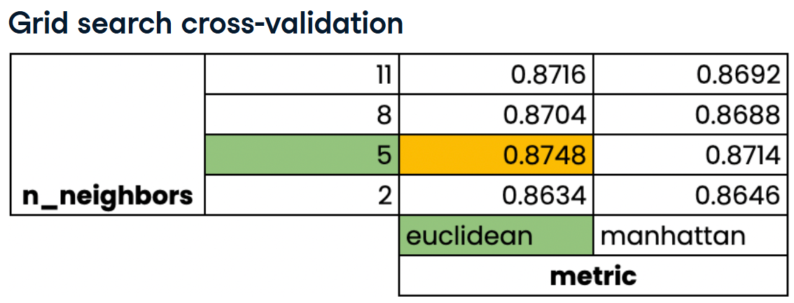

Different models have different **hyperparameters** that we can tune to increase model performance. Hyperparameters are parameters that we specify before fitting the model to the data. 
* Ridge/lasso regression: Alpha
* KNN: n_neighbors

(Sidenote: **Hyperparameters** are variables that the user specifies. **Parameters** are variables such as coefficients that are just part of the model.)

**Hyperparameter tuning** is a process for choosing the optimal hyperparameters. In this process, you try various hyperparamter values, fit them separately, and judge their performance to find the best values. When doing so, it is important to use cross-validation (CV) so we don't end up with overfitting. 

**Grid search CV** and **random search CV** are two potential methods for using CV to tune our hyperparameters. 

## Grid Search CV
In grid search CV, you choose which hyperparameter values to try and which metric(s) to evaluate them by. This returns a grid of metric results. 

For example, the table below shows the results for n_neighbors 2, 5, 8, and 11 with euclidean and manhattan metrics. 


```python
# Import GridSearchCV
from sklearn.model_selection import GridSearchCV

# Instantiate KFold
kf = KFold(n_splits=5, shuffle=True, random_state=99)

# Create the parameter grid dictionary we want to use for tuning
    # Alphas: in this case, a range of twenty evenly-spaced values from 0.00001 to 1
    # Solver: the metrics (defaults to R-squared)
param_grid = {"alpha": np.linspace(0.00001, 1, 20), "solver": ["sag", "lsqr"]}

# Instantiate the model (ridge, in this example)
ridge = Ridge()

# Create a grid search object, passing the model and parameter grid
ridge_cv = GridSearchCV(ridge, param_grid, cv=kf)

# Fit the grid search object to the training data
ridge_cv.git(X_train, y_train)

# Print the model's best parameters and best score
    # In this case, it will return the best alpha value, the best solver, and the mean CV score for that fold
print(ridge_cv.best_params_, ridge_cv.best_score_)
```

**Grid search CV** can be problematic because it doesn't scale well. The time and resources required is a product of the number of folds, the number of hyperparameters, and the number of values for each hyperparameter. 
* e.g. 3 folds, 1 hyperparameter, 10  values = 30 fits
* 10 folds, 3 hyperparamters, 30 values = 900 fits

## Random Search CV

This process picks random hyperparameter values rather than searching through all possible combinations of the hyperparameter values we feed it, so it is less resource demanding than grid search. The process in scikit-learn is very similar to the one above:

```python
# Import Random Search CV
from sklearn.model_selection import RandomizedSearchCV

# Instantiate KFold
kf = KFold(n_splits=5, shuffle=True, random_state=99)

# Set up the parameter grid dictionary
param_grid = {"alpha": np.linspace(0.00001, 1, 20), "solver":["sag", "lsqr"]}

# Instantiate the model
ridge = Ridge()

# Create the grid search object, this time with the optional n_iter
    # n_iter determines how many values are tested per hyperparameter
ridge_cv = RandomizedSearchCV(ridge, param_grid, cv=kf, n_iter=2)

# Fit the model
ridge_cv.fit(X_train, y_train)

# Print the model's best parameters and best score
print(ridge_cv.best_params_, ridge_cv.best_score_)
```


