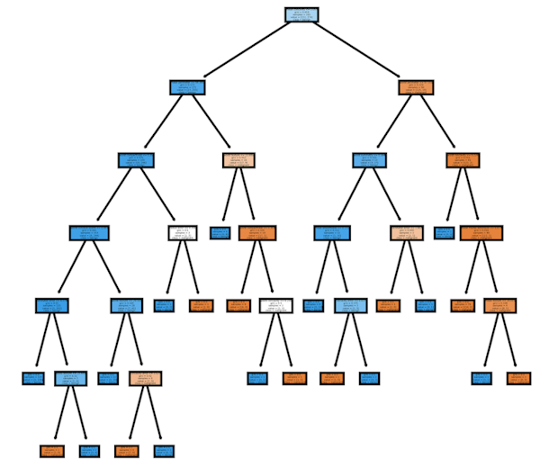
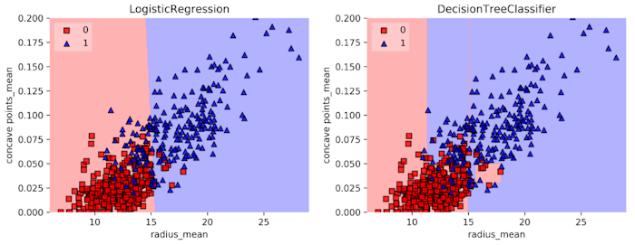

The last few entries have been a back-to-basics review of concepts I've already learned. I'm excited now to dive into something that I know _of_, but have not actually used a lot. 

**CART** stands for "Classification and Regression Trees." 
* Advantages: 
    * Simple to understand and interpret
    * Easy to use
    * Flexible with non-linear dependences between features/target
    * No need to standardize/normalize features beforehand
* Limitations: 
    * Classification trees can only produce orthoganal decision boundaries (perpendicular to axis)
    * Sensitive to small variations in the training set
    * High variance if trained without constraints (--> overfitting)

What are classification trees? How do they work? 
* They use a sequence of if-else statements about features to infer labels. Each statement has one feature and one split. 
* They can work with non-linear relationships between features and labels.
* You do not have to standardize the data.




The **maximum depth** is the maximum branches between the top and an extreme end. 

A classification tree creates rectangular **decision regions** (regions where instances are assinged a class label), separated by **decision boundaries**. Note the difference between how logistic regression and decision trees divide the instances: 



Setting up a basic decision tree in python: 

```python
# Run the imports
from sklearn.tree import DecisionTreeClassifier
from sklearn.model_selection import train_test_split
from sklearn.metrics import accuracy_score

# Split the data
X_train, X_test, y_train, y_test = train_test_split(X, y, test_size=0.2, stratify=y, random_state=99)

# Instantiate the model
dt= DecisionTreeClassifier(max_depth=2, random_state=99)

# Fit the model to the training data
dt.fit(X_train, y_train)

# Predict from the test set
y_pred = dt.predict(X_test)

# Evaluate the accuracy
accuracy_score(y_test, y_pred)
```

You can plot decision tree regions like in the image above. The code below assumes you already have a "logreg" model and a "dt" model. 

```python
# Make a list of your models
models = [logreg, dt]

# Show the decision regions
plot_labeled_decision_regions(X_test, y_test, models)
```
