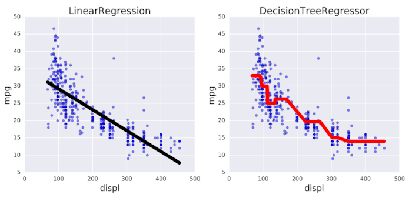

In the last couple of practice sessions, I was looking at regression for classification. How do they work for a regression problem, when the target variable is continuous? 

In a regression tree, the impurity is measuring by the MSE of the targets in a node - how spread out/mixed the target values are. The goal for each split is then to minimize this impurity. (A lower MSE = a more pure/homegenous node with less variance in the target values.)

Why use a regression tree over a typical linear regression model? One benefit is that decision trees are more flexible - they can better capture non-linear relationships between feature and target variables. 



We can use scikit-learn's DecisionTreeRegressor() to create a model for regression. The "min_samples_leaf" parameter below is set to 0.1, meaning that each leaf has to include at least 10% of the training data. 

```python
# Run the imports
from sklearn.tree import DecisionTreeRegressor
from sklearn.model_selection import train_test_splitl
from sklearn.metrics import mean_squared_error as MSE

# Split the data
X_train, X_test, y_train, y_test = train_test_split(X, y, test_size=0.2, random_state=99)

# Instantiate the model
dt = DecisionTreeRegressor(max_depth=4, min_samples_leaf=0.1, random_state=99)

# Fit and predict
dt.fit(X_train, y_train)
y_pred = dt.predict(X_test)

# Obtain MSE
mse_dt = MSE(y_test, y_pred)

# Use MSE to get RMSE (power of 1/2 is equivalent of square root)
rmse_dt = mse_dt**(1/2)

# Print the score to 2 decimal places
print("Test set RMSE of dt: {:.2f}".format(rmse_dt))
```

