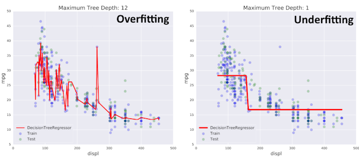

Remember, we want to avoid **overfitting** and **underfitting**. In overfitting, the model fits the noise in the training set and will not handle new data well. In underfitting, the model is not flexible enough to capture the relationship between variables and thus will also not be helpful in making predictions from new data. 



A **generalization error** is a measure of how well a model generalizes to new data. It is based on bias, variance, and irreducible error. We want the lowest possible generalization error, finding a balance between bias and variance. 
* **Bias**: The errors a model makes due to its assumptions. Can lead to **underfitting** if the model fails to capture important patterns. 
    * Example: If a simple linear regression model is trained on complex non-linear data, it will likely have high bias. 
    * To reduce bias: Use more complex models, add features, or improve feature engineering. 
* **Variance**: How sensitive the model is to fluctuations in the data. Can lead to **overfitting** if the model is trained to the noise rather than the underlying patterns. 
    * Example: A complex model with a lot of parameters fit to a small dataset may have high variance. 
    * To reduce variance: Use regularization techniques, cross-validation, reduce model complexity, or gather more data. 
* **Irreducible error**: Noise. Errors that cannot be reduced due to choosing a "better" model. 

As bias increases, variance decreases, and vice versa. This is the bias-variance tradeoff. 


So, how do we practically deal with this? How do we estimate the generalization error? 

We use cross-validation (K-Fold CV, Hold-Out CV) and compute the mean of the errors, then compare that to the training set errors. 
* If CV error > training error: the model suffers from high variance (overfitting). 
* If CV error is similar to training error but greater than desired error: the model suffers from high bias (underfitting). 

```python
# Run the imports
from sklearn.tree import DecisionTreeRegressor
from sklearn.model_selection import train_test_split, cross_val_score
from sklearn.metrics import mean_squared_error as MSE

# Split the data
X_train, X_test, y_train, y_test = train_test_split(X, y, test_size = 0.3, random_state=99)

# Instantiate the decision tree regressor
dt = DecisionTreeRegressor(max_depth=4, min_samples_leaf=0.14, random_state=99)

# Evaluate the MSE/RMSE from 10-fold CV
MSE_CV = cross_val_score(dt, X_train, y_train, cv=10, scoring='neg_mean_squared_error', n_jobs=-1)
RMSE_CV = (MSE_CV.mean())**(1/2)

# Fit the model
dt.fit(X_train, y_train)

# Create predictions from both train and test sets
y_predict_train = dt.predict(X_train)
y_predict_test = dt.predict(X_test)

# Evaluate the MSE/RMSE from training and test sets (Recall: RMSE is easier to interpet)
MSE_train = MSE(y_train, y_predict_train)
MSE_test = MSE(y_test, y_predict_test)

RMSE_train = MSE_train ** (1/2)
RMSE_test = MSE_test ** (1/2)

# Print the MSE for the three outputs
print("CV MSE: {:.2f}".format(MSE_CV.mean()))
print("Train MSE: {:.2f}".format(MSE_train))
print("Test MSE: {:.2f}".format(MSE_test))

# Or, print the RMSE:
print("CV RMSE: {:.2f}".format(RMSE_CV.mean()))
print("Train RMSE: {:.2f}".format(RMSE_train))
print("Test RMSE: {:.2f}".format(RMSE_test))

```
