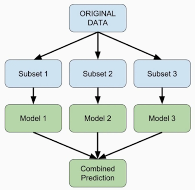

**Ensemble Learning** has the flexibility of a CART but without the tendency to memorize noise. 

The process: 
1. Train different models on same data
2. Make predictions with each model
3. Use meta-model to aggregate the predictions and create a final prediction. This final prediction should be more robutst than the individual models. 

For best results, the models should be skillful in different ways. 



One example of ensemble learning for classification tasks is sklearn's **Voting Classifier**. There are two types of voting classifier: 
1. Hard voting: The predicted class is the one with the highest majority of votes among the models. (e.g. Two out of three models predicted an output of 1, so the final prediction is 1.)
2. Soft voting: The model takes the averages of the probabilities from the models and uses that average to determine the final prediction. 

```python
# Run the imports for metrics, splitting, models, and voting classifier
from sklearn.metrics import accuracy_score
from sklearn.model_selection import train_test_split
from sklearn.linear_model import LogisticRegression
from sklearn.tree import DecisionTreeClassifier
from sklearn.neighbors import KNeighborsClassifier as KNN
from sklearn.ensemble import VotingClassifier 

# Set the seed
SEED = 99

# Split the data
X_train, X_test, y_train, y_test = train_test_split(X, y, test_size=0.3, random_state=SEED)

# Instantiate the various models
lr = LogisticRegression(random_state=SEED)
knn = KNN()
dt = DecisionTreeClassifier(random_state=SEED)

# Create a classifier list with tuples for each one's name
classifiers = [("Logistic Regression", lr), 
                ("K Nearest Neighbors", knn),
                ("Classification Tree", dt)]

# Use a for loop to fit, predict, and print accuracy for each model (for comparison)
for clf_name, clf in classifiers: 
    clf.fit(X_train, y_train)
    y_pred = clf.predict(X_test)
    accuracy = accuracy_score(y_test, y_pred)
    print("{:s} : {:.3f}".format(clf_name, accuracy))

# Instantiate the voting classifier
vc = VotingClassifier(estimators=classifiers)

#  Fit vc and predict
vc.fit(X_train, y_train)
y_pred = vc.predict()

# Evaluate accuracy for vc
print("Voting Classifier: {.3f}".format(accuracy_score(y_test, y_pred)))
```